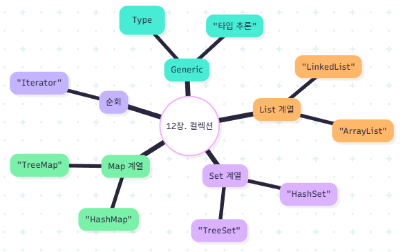

# [강의 요약] 12장. 컬렉션 프레임워크와 제네릭

## 🎯 강의 목표
* **제네릭(Generic) 이해**: 다양한 자료형에 대응할 수 있는 범용적인 클래스 설계 방식을 습득한다.
* **프레임워크 구조 파악**: `Collection(List, Set)`과 `Map` 인터페이스의 계층 구조를 이해한다.
* **효율적인 자료구조 선택**: 프로그램 목적에 따라 순서 보장, 중복 허용 여부 등을 고려하여 적절한 클래스를 선택할 수 있다.

---

## 📝 주요 강의 내용

### 1. 제네릭(Generic) 프로그래밍
* **자료형 매개변수 `<T>`**: 'Type'의 약자로, 실제 클래스를 사용할 때 구체적인 타입을 지정한다.
* **제네릭 메서드**: 메서드의 매개변수나 반환형에 제네릭을 적용하여 범용성을 높일 수 있다.

### 2. Collection 인터페이스
#### (1) List 인터페이스 (순서 O, 중복 O)
* **ArrayList**: 내부적으로 객체 배열을 사용하며, 요소 추출 속도가 빠르다.
* **Vector**: `ArrayList`와 유사하나 멀티스레드 동기화를 지원한다.
* **LinkedList**: 요소와 요소가 주소로 연결된 구조로, 중간에 데이터를 삽입/삭제할 때 효율적이다.

#### (2) Set 인터페이스 (순서 X, 중복 X)
* **HashSet**: 데이터의 중복을 허용하지 않는다. 객체의 `hashCode()`와 `equals()`를 이용해 동일 객체 여부를 판단한다.
* **TreeSet**: 이진 검색 트리 구조로 데이터를 저장하며, 데이터를 정렬된 상태로 유지한다. (`Comparable` 또는 `Comparator` 구현 필요)

### 3. Map 인터페이스 (Key-Value)
* **특징**: 키(Key)는 중복될 수 없으며, 값(Value)은 중복이 가능하다.
* **HashMap**: 가장 많이 사용되는 Map 구현체로, 해시 알고리즘을 사용하여 검색 속도가 매우 빠르다.
* **TreeMap**: 키 값을 기준으로 정렬된 상태를 유지한다.

---

## 🚀 수업 후 할 수 있는 일
* **대기열 시스템 구현**: 먼저 들어온 데이터를 먼저 처리하는 구조를 `LinkedList`를 응용해 구현해 본다.
* **로또 번호 생성기**: 1~45 사이의 무작위 숫자를 생성하여 `HashSet`에 담아 중복 없는 6개의 숫자를 뽑아본다.
* **사전(Dictionary) 만들기**: 단어(Key)와 뜻(Value)을 매칭하여 저장하는 `HashMap` 기능을 구현해 본다.

## 수업 관련 마인드 맵

